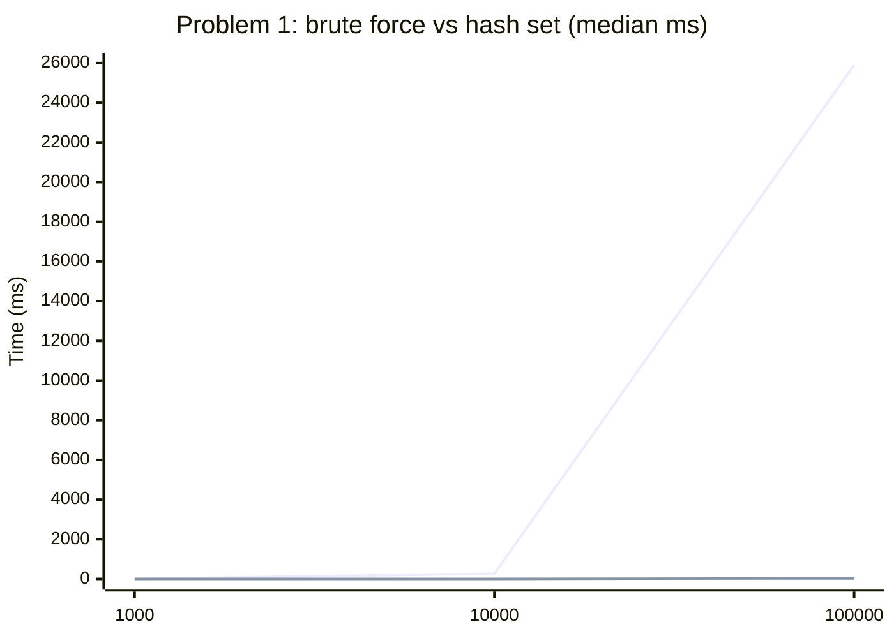
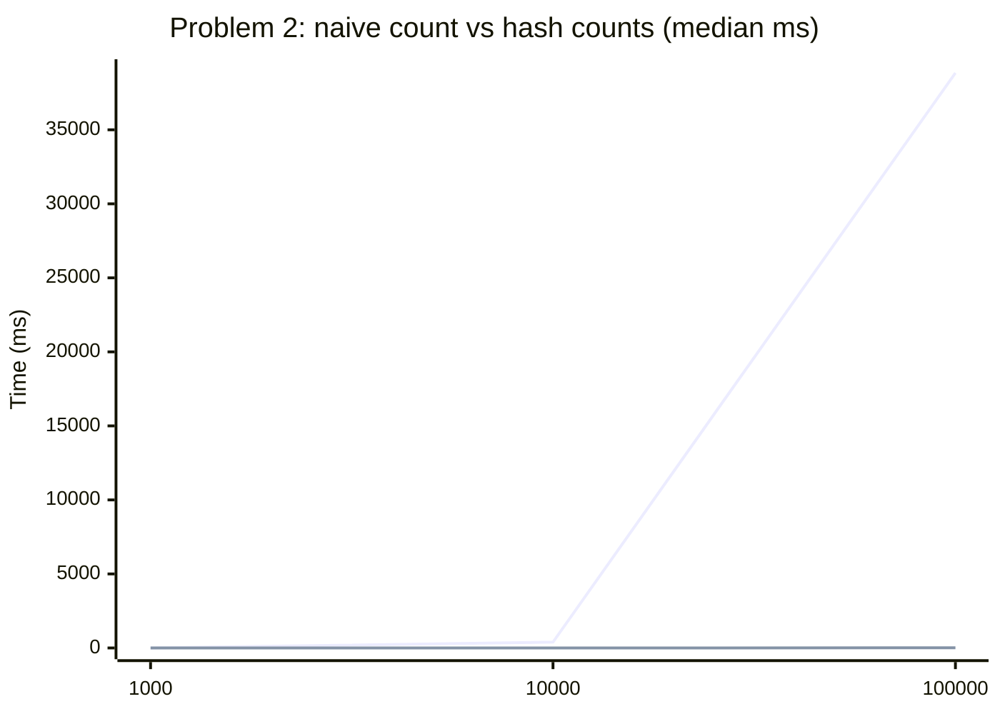
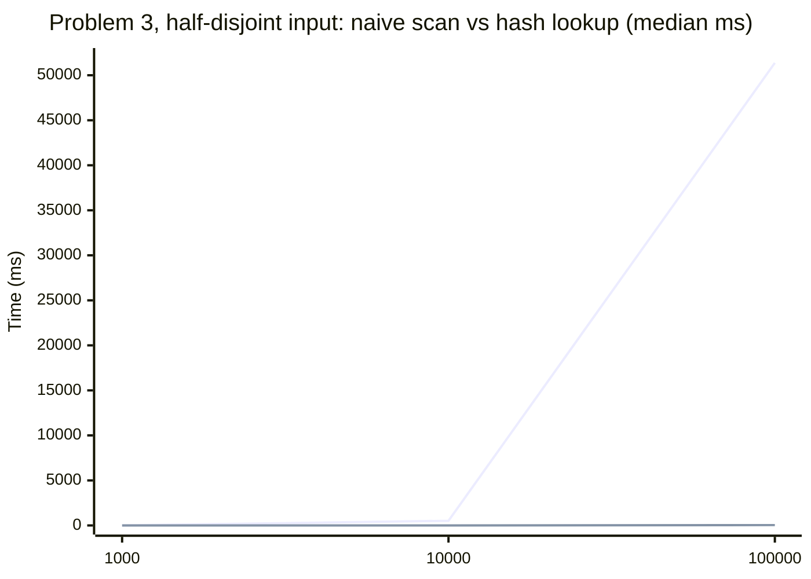

# Complexity Analysis and Performance Report

This lab compares two correct approaches to the same problem. The goal is not simply to get the right answer, but to observe how algorithmic design changes runtime.

## Measurement setup

| Item | Value |
| --- | --- |
| CPU | Intel Xeon @ 2.80 GHz (x86-64), single-threaded |
| OS | Ubuntu 24.04, Linux 6.18 |
| Compiler | g++ 13.3.0, `-std=c++17 -Wall -Wextra -pedantic`, no optimization flag |
| Clock | `std::chrono::steady_clock` |
| Trials | 3 per input size, median reported |
| Input sizes | 1,000 / 10,000 / 100,000 / 1,000,000 |

Data creation happens outside the timed region. Only the algorithm call sits between the two clock reads, and the result is written to a `volatile` variable so the compiler cannot discard the work.

Raw output is in `docs/benchmark_results.csv`, produced by:

```bash
make
./build/benchmark_app 1000000 3 100000 > docs/benchmark_results.csv
```

### Why the naive measurements stop at 100,000

The third argument caps the input size for the naive algorithms only. At n = 100,000 a single naive trial already takes 26 to 51 seconds. The naive algorithms are quadratic, so n = 1,000,000 costs roughly 100 times more: 45 to 85 minutes per trial, or several hours for three trials of three problems. The efficient implementations are linear and run to 1,000,000 without trouble, so the experiment keeps the full range for them and stops the naive measurements at 100,000.

## Tie-breaking rule for the frequency problem

When two values have the same frequency, the implementation returns the smaller numeric value.

This rule is used in both the naive and efficient implementations so the results are comparable. `mostFrequentNaive` applies it by scanning positions in order and preferring a smaller value on an equal count; `mostFrequentEfficient` applies the same comparison while walking the frequency table, whose iteration order is unspecified. Because the rule is a total order on (count, value), both arrive at the same answer regardless of traversal order.

## Problem 1 — Duplicate detection

### Algorithm A: Brute force

- Description: compare every pair of values in the array.
- Time complexity: O(n^2)
- Space complexity: O(1)
- Why: for each of n values, the code may compare against up to n - 1 other values.

### Algorithm B: Hash set

- Description: insert each value into a hash set; if a value is already present, a duplicate exists.
- Time complexity: O(n) average case
- Space complexity: O(n)
- Why: each value is inserted and looked up in expected constant time.

### Measured results

Input: an array of n distinct values, which is the worst case for both algorithms because neither can return early.

| n | Brute force (ms) | Growth | Hash set (ms) | Growth | Brute force / hash set |
| ---: | ---: | ---: | ---: | ---: | ---: |
| 1,000 | 2.75 | — | 0.234 | — | 12x |
| 10,000 | 264.71 | 96.2x | 2.303 | 9.9x | 115x |
| 100,000 | 25,905.54 | 97.9x | 25.531 | 11.1x | 1,015x |
| 1,000,000 | not measured | — | 253.418 | 9.9x | — |



### Discussion

Every 10x increase in n multiplies the brute-force time by about 97, which is the 100x that O(n^2) predicts. The hash-set version multiplies by about 10, which is the 10x that O(n) predicts. The two lines therefore separate by a factor of 10 with every step: 12x at n = 1,000 and 1,015x at n = 100,000.

The measured factor falls slightly below the theoretical 100 because the brute-force loop also gets more cache-friendly work per comparison as the array grows past the small sizes, and because fixed overhead is a larger share of the 1,000-element measurement.

The hash set pays for this with memory. It stores up to n keys, while the brute-force version uses two indices and nothing else.

## Problem 2 — Most frequent value

### Algorithm A: Naive counting

- Description: for each value, scan the whole array and count occurrences.
- Time complexity: O(n^2)
- Space complexity: O(1)
- Why: each value requires a full pass through the array.

### Algorithm B: Hash table counts

- Description: count frequencies in one pass, then inspect the counts.
- Time complexity: O(n) average case
- Space complexity: O(k), where k is the number of distinct values
- Why: hash table operations are expected constant time per value.

### Measured results

Input: n values drawn from 7 distinct numbers.

| n | Naive count (ms) | Growth | Hash counts (ms) | Growth | Naive / hash |
| ---: | ---: | ---: | ---: | ---: | ---: |
| 1,000 | 4.01 | — | 0.090 | — | 45x |
| 10,000 | 394.05 | 98.3x | 0.886 | 9.8x | 445x |
| 100,000 | 38,846.21 | 98.6x | 8.774 | 9.9x | 4,427x |
| 1,000,000 | not measured | — | 87.437 | 10.0x | — |



### Discussion

This is the widest gap in the lab: 4,427x at n = 100,000. The reason is that the naive version does not benefit from the input having only 7 distinct values. It counts occurrences of `values[i]` for every index i, so it performs the same seven counting passes about n/7 times each. The hash version does the opposite — it collapses the array to 7 table entries in one pass, then scans 7 entries.

Space here is O(k) rather than O(n), and k is 7, so the "efficient version uses more memory" tradeoff is nearly free on this input. On an input of n distinct values the table would hold n entries instead.

## Problem 3 — Common elements between two arrays

### Algorithm A: Naive scan

- Description: take each value from the first array and scan the second array to see whether it appears there.
- Time complexity: O(n x m) worst case
- Space complexity: O(k), where k is the number of distinct values found in common
- Why: each of the n values in the first array may require checking all m values in the second.

### Algorithm B: Hash-based lookup

- Description: build a hash set from the second array, then examine each value in the first array.
- Time complexity: O(n + m) average case
- Space complexity: O(m)
- Why: set construction and lookup are each expected constant time per element.

### Measured results, input A: dense overlap

Both arrays are built from 19 distinct values (`i % 19` and `i * 13 % 19`).

| n | Naive scan (ms) | Growth | Hash lookup (ms) | Growth | Naive / hash |
| ---: | ---: | ---: | ---: | ---: | ---: |
| 1,000 | 0.236 | — | 0.250 | — | 0.9x |
| 10,000 | 2.038 | 8.6x | 2.383 | 9.5x | 0.9x |
| 100,000 | 20.004 | 9.8x | 23.928 | 10.0x | 0.8x |
| 1,000,000 | not measured | — | 239.808 | 10.0x | — |

The naive version wins here, and it grows linearly rather than quadratically. That result is correct, and it is a property of the input rather than of the algorithm. Every value in the left array appears within the first 19 positions of the right array, so the inner scan stops almost immediately. The `seen` list never exceeds 19 entries either, so the duplicate check that guards it is also cheap. The naive version therefore does about 10 operations per element with no hashing, while the hash version pays for building a 19-element table and hashing every one of the n + m values.

An O(n x m) algorithm measured on an input that never triggers its worst case does not produce an O(n x m) curve. This is the practical lesson of the experiment: the benchmark input decides what the benchmark measures.

### Measured results, input B: half-disjoint ranges

To reach the worst case, the second scenario compares `[0, n)` against `[n/2, n/2 + n)`. Half the left values are absent from the right array, so the naive scan must traverse the entire right array before giving up on each of them.

| n | Naive scan (ms) | Growth | Hash lookup (ms) | Growth | Naive / hash |
| ---: | ---: | ---: | ---: | ---: | ---: |
| 1,000 | 5.39 | — | 0.413 | — | 13x |
| 10,000 | 515.88 | 95.7x | 4.049 | 9.8x | 127x |
| 100,000 | 51,369.03 | 99.6x | 41.478 | 10.2x | 1,238x |
| 1,000,000 | not measured | — | 414.231 | 10.0x | — |



With this input the naive version grows by a factor of about 99 per 10x increase, matching O(n x m) with n = m, and the hash version stays at about 10x. The same two implementations that looked equivalent on input A differ by 1,238x on input B.

## Conclusions

1. Growth rate, not the measurement at one size, is what the complexity class predicts. Every quadratic implementation in this lab multiplied its runtime by 96 to 100 for each 10x increase in n; every linear one multiplied by about 10.
2. A constant-factor advantage disappears quickly. The naive scan was 10% faster than the hash lookup on input A at n = 1,000 and 1,238x slower on input B at n = 100,000.
3. The two implementations of each problem were checked against each other before timing. The tests in `tests/test_algorithms.cpp` cover empty arrays, single elements, negative values, ties and large inputs, and `app/main.cpp` prints the agreement check. A benchmark of two algorithms that disagree measures nothing useful.
4. The speedups cost memory: O(n) for the duplicate hash set, O(k) for the frequency table, O(m) for the common-element set. On these inputs the memory was small, but the tradeoff is the standard one.
5. The benchmark input is part of the experiment. Problem 3 produces two opposite conclusions from the same code depending on how much the two arrays overlap.
